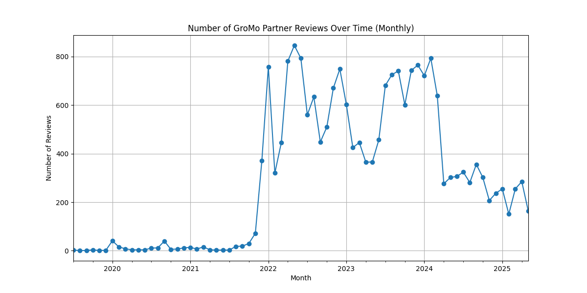
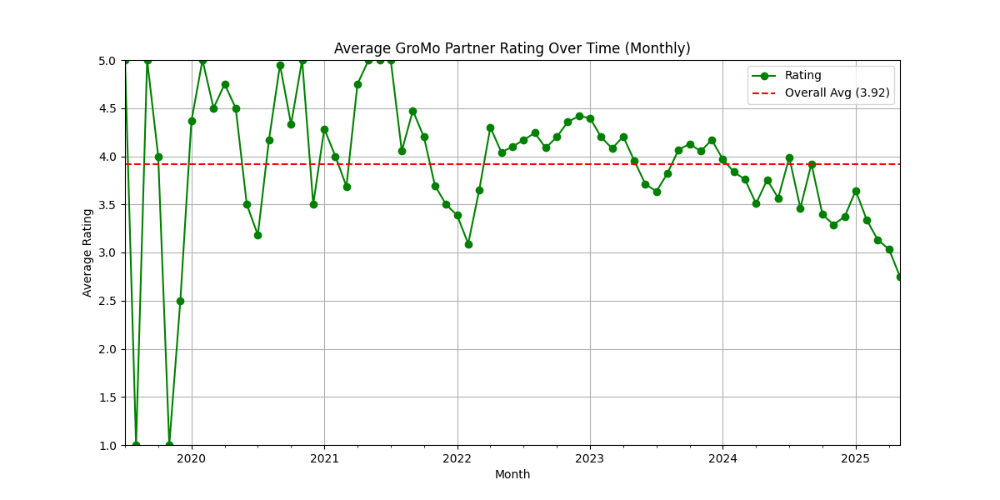
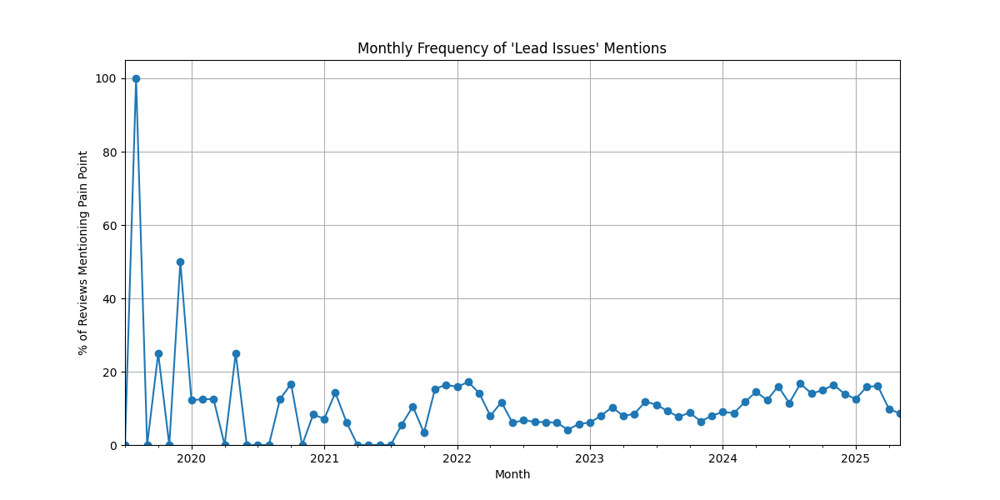
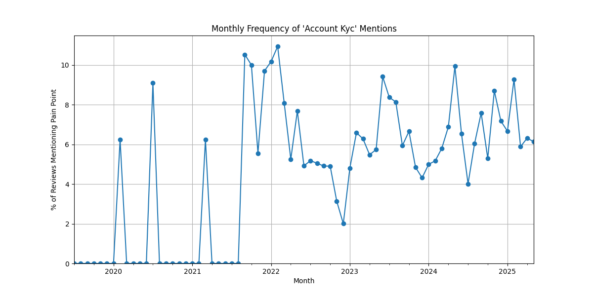
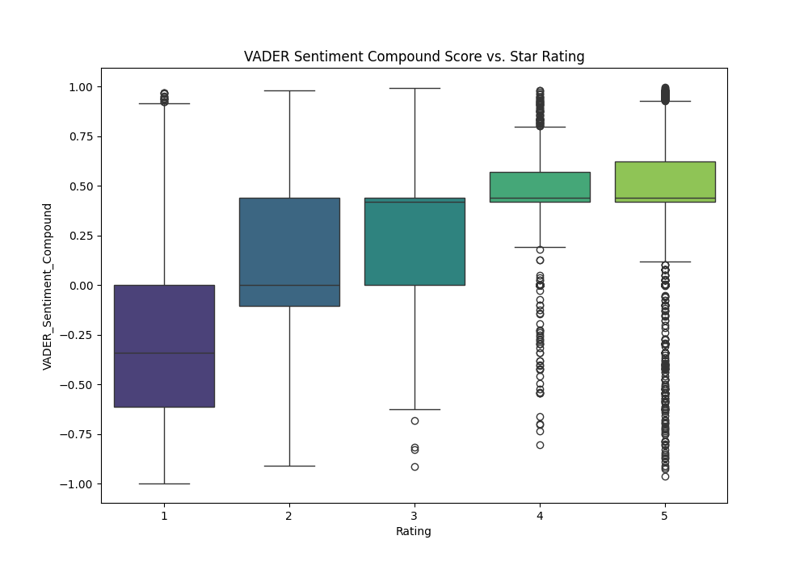
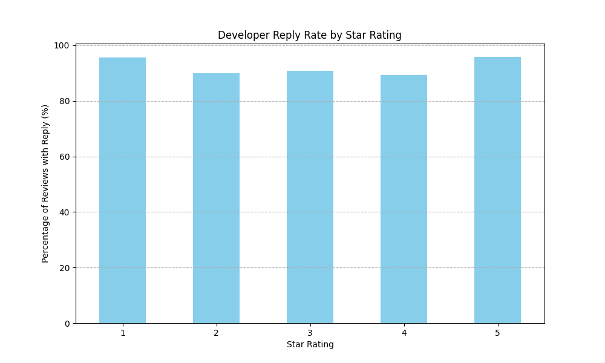

# GroMo Partner Analysis and Research Findings Report

## 1. Introduction

This report presents an analysis of feedback from GroMo Partners, primarily derived from Google Play Store reviews and supplemented by insights from web scraping and internal feedback channels, such as the GroMo AI Hackathon 2025. The objective is to identify key pain points and areas for improvement within the GroMo platform and Partner experience.

**Data Sources:**

- Google Play Store Reviews for the GroMo application (`gromo_play_store_reviews_detailed.csv`)
- Insights from web scraping and internal feedback (e.g., GroMo AI Hackathon 2025)

**Methodology:**
The analysis utilized a Python script (`data_analysis.py`) to process the Play Store review data. The methodology included:

- Loading and preprocessing review data, including date and rating validation.
- Analyzing overall rating distribution and trends over time.
- Performing text preprocessing on review messages (tokenization, stop word removal, lemmatization).
- Identifying frequent terms and phrases (N-grams) in negative reviews.
- Conducting sentiment analysis using the VADER lexicon.
- Analyzing developer response rates to reviews.
- Tracking the frequency of mentions for specific pain points over time using keyword matching.

The findings are supported by visualizations generated during the analysis process.

## 2. Overall Review Landscape

### 2.1 Rating Distribution

The distribution of star ratings provides an initial overview of Partner satisfaction.

_Figure 2.1: Distribution of GroMo Partner Ratings_

**Findings:** The rating distribution graph (Figure 2.1) shows a significant number of both high (4 and 5 stars) and low (1 and 2 stars) ratings. This indicates a polarized user base, with a group of highly satisfied Partners and another group experiencing significant issues. The average rating provides a single metric but the distribution is key to understanding the spread of sentiment.

**Conclusion:** While there is a segment of satisfied Partners, the substantial volume of low ratings highlights critical areas of dissatisfaction that need to be addressed to improve the overall Partner experience.

### 2.2 Review Volume and Average Rating Over Time

Analyzing review volume and average rating trends helps understand how feedback has evolved.

_Figure 2.2: Number of GroMo Partner Reviews Over Time (Monthly)_

_Figure 2.3: Average GroMo Partner Rating Over Time (Monthly)_

**Findings:** Figure 2.2 illustrates the monthly volume of reviews, showing periods of increased or decreased Partner engagement in providing feedback. Figure 2.3 tracks the average rating over time, indicating whether Partner sentiment has been improving, declining, or remaining stable. Observing these trends together can reveal if changes in review volume correlate with shifts in average satisfaction.

**Conclusion:** Monitoring these trends is essential for identifying the impact of platform updates, marketing campaigns, or operational changes on Partner feedback and overall sentiment.

## 3. Detailed Pain Point Analysis

This section delves into specific issues raised by GroMo Partners, supported by keyword analysis and trend data.

### 3.1 Training Quality and Product Information

Partners have expressed concerns regarding the adequacy and personalization of training materials and product information.

_Figure 3.1: Monthly Frequency of 'Product Info / Training' Mentions_

**Findings:** The trend graph for 'Product Info / Training' mentions (Figure 3.1) tracks how frequently these terms appear in reviews over time. The qualitative feedback indicates Partners find the training generic and lacking personalization, hindering their ability to build specific skills and close deals. The AI Hackathon feedback specifically noted that training wasn't targeted enough to improve abilities.

**Conclusion:** The current training and product information resources are perceived as inadequate by some Partners, potentially impacting their confidence and effectiveness in selling financial products on the platform.

### 3.2 Commission and Payment Issues

Issues related to commission transparency, calculation, and timely payouts are significant pain points.

_Figure 3.2: Monthly Frequency of 'Commission / Earnings' Mentions_

_Figure 3.3: Monthly Frequency of 'Payment Issues' Mentions_

**Findings:** Figures 3.2 and 3.3 show the monthly frequency of mentions for 'Commission / Earnings' and 'Payment Issues'. Partner feedback consistently highlights unclear commission structures and significant delays in payouts, sometimes exceeding the stated 10-12 business days. A lack of transparency regarding lead status also contributes to uncertainty about expected commissions.

**Conclusion:** Issues surrounding commission transparency and timely payments are major sources of frustration and distrust among Partners, directly impacting their financial expectations and motivation to use the platform.

### 3.3 Lead Generation and Conversion

Partners face challenges in acquiring quality leads and effectively converting them into sales.

_Figure 3.4: Monthly Frequency of 'Lead Issues' Mentions_

**Findings:** The trend for 'Lead Issues' mentions (Figure 3.4) reflects the ongoing challenges Partners face in the initial stages of the sales process. Feedback indicates difficulty in generating high-quality leads and converting them. Partners report wasting time on leads that are unlikely to convert and a lack of guidance on effective customer engagement strategies, a point also raised during the AI Hackathon.

**Conclusion:** The struggles with lead generation and conversion directly impact Partners' earning potential and efficiency, suggesting a need for improved lead quality or enhanced sales guidance.

### 3.4 App Performance and Technical Issues

Technical problems and platform stability affect the Partner experience and ability to conduct business smoothly.

_Figure 3.5: Monthly Frequency of 'App Performance' Mentions_

**Findings:** Figure 3.5 tracks mentions of 'App Performance' issues. While the script notes that GroMo's customer support generally resolves technical problems quickly, some Partners still report encountering bugs, crashes, and performance issues that disrupt their ability to conduct business smoothly on the platform.

**Conclusion:** Although support is responsive, the occurrence of technical issues can still negatively impact the Partner workflow and overall platform reliability perception.

### 3.5 Customer Support

The responsiveness and effectiveness of customer support are crucial for resolving Partner queries and issues.

_Figure 3.6: Monthly Frequency of 'Customer Support' Mentions_

**Findings:** The trend for 'Customer Support' mentions (Figure 3.6) indicates the frequency with which Partners discuss their interactions with the support team. While the script mentions positive feedback on the speed of technical issue resolution, the overall sentiment and types of issues raised in reviews provide a broader view of the perceived effectiveness and helpfulness of customer support for various queries.

**Conclusion:** The analysis of customer support mentions helps gauge Partner satisfaction with the assistance they receive, which is crucial for resolving issues and maintaining trust.

### 3.6 Account and KYC Issues

Problems related to account verification (KYC), activation, or blocking can prevent Partners from using the platform.

_Figure 3.7: Monthly Frequency of 'Account / KYC' Mentions_

**Findings:** Figure 3.7 shows the trend for mentions related to 'Account / KYC'. These issues often involve difficulties with the verification process, account activation, or unexpected account blocking. Such problems can prevent Partners from fully utilizing the platform or accessing their earnings.

**Conclusion:** Friction in the account and KYC processes can create significant barriers for new and existing Partners, leading to frustration and potential churn.

## 4. Other Insights from Text Analysis

### 4.1 Common Terms in Negative Reviews

Analyzing frequently used words and phrases in negative reviews provides direct insight into Partner frustrations.

_Figure 4.1: Top Bigrams in Negative Reviews_

**Findings:** The N-gram analysis and word cloud for negative reviews (Figure 4.1 shows top bigrams) highlight the most frequently used words and phrases by dissatisfied Partners. These terms often directly relate to the pain points discussed, such as "payment pending," "customer care," "lead fake," or "app update problem," providing specific language used by the user base.

**Conclusion:** Analyzing common terms in negative feedback offers direct insight into the specific aspects of the platform or process causing frustration, complementing the broader pain point categories.

### 4.2 Sentiment Analysis

VADER sentiment analysis provides a quantitative measure of the emotional tone in reviews.

_Figure 4.2: Sentiment Distribution of Reviews (VADER)_

_Figure 4.3: VADER Sentiment Compound Score vs. Star Rating_

**Findings:** Figure 4.2 shows the overall distribution of sentiment (Positive, Neutral, Negative) as determined by the VADER tool. Figure 4.3 plots the VADER compound sentiment score against the star rating provided by the user. This comparison helps validate the automated sentiment analysis against manual ratings and can reveal cases where the sentiment expressed in the text might differ from the star rating given.

**Conclusion:** Sentiment analysis provides a quantitative perspective on the emotional tone of reviews, offering another dimension to understand Partner satisfaction beyond just the star rating.

### 4.3 Developer Engagement

The rate at which the GroMo team responds to reviews indicates their level of engagement with Partner feedback.

_Figure 4.4: Developer Reply Rate_

_Figure 4.5: Developer Reply Rate by Star Rating_

**Findings:** Figure 4.4 shows the overall percentage of reviews that have received a developer reply, while Figure 4.5 breaks down the reply rate by star rating. A higher reply rate, especially for lower ratings, can indicate active engagement from the GroMo team in addressing Partner concerns and attempting to resolve issues or provide clarification.

**Conclusion:** The developer engagement metrics provide insight into the platform's responsiveness to user feedback, which can influence Partner perception of being heard and valued.

## 5. Overall Conclusion

The analysis of GroMo Partner feedback reveals several key areas requiring attention to improve Partner satisfaction and success on the platform. The most prominent issues highlighted by Partners include:

- **Training and Product Information Gaps:** Partners feel the training is too generic and lacks the personalization and real-time guidance needed for effective selling.
- **Commission and Payment Inconsistencies:** Lack of transparency in commission structures and delays in payouts erode Partner trust and financial stability.
- **Challenges in Lead Management:** Difficulty in generating quality leads and converting them impacts earning potential and wastes Partner effort.
- **Platform Technical Stability:** While generally responsive, occasional bugs and performance issues disrupt business operations.
- **Customer Trust and Communication Skills:** Partners recognize the importance of building trust and improving communication, suggesting a need for support in these areas.
- **Account and KYC Process Friction:** Issues with account verification and access can be a barrier to entry and continued use of the platform.

Addressing these pain points, particularly those related to training, commissions, and lead management, is crucial for fostering a more supportive and effective environment for GroMo Partners, ultimately contributing to their success and the growth of the platform. Further deep-dives into specific negative feedback within each category could provide more granular insights for targeted interventions.
