# GroMo Play Store Review Analysis

This repository contains scripts and data for analyzing GroMo Play Store reviews to understand user feedback, identify key trends, and pinpoint areas for improvement.

## Files

- [`gromo_play_store_reviews_detailed.csv`](gromo_play_store_reviews_detailed.csv): The raw dataset of Play Store reviews.
- [`gromo_play_store_rating_1.csv`](gromo_play_store_rating_1.csv): Filtered dataset containing only 1-star reviews, generated by [`Negative_ratings_constructor.py`](Negative_ratings_constructor.py).
- [`data_analysis.py`](data_analysis.py): Python script for performing comprehensive analysis on the review data and generating visualizations.
- [`Negative_ratings_constructor.py`](Negative_ratings_constructor.py): Python utility script to filter reviews by rating.
- `Readme.md`: This file.

## Analysis Process

The analysis is performed using the [`data_analysis.py`](data_analysis.py) script, following the process outlined below:

```mermaid
graph TD
    A[Load Data from CSV] --> B{Filter Future Dates?};
    B -- Yes --> C[Remove Future Dates];
    B -- No --> D[Proceed with Data];
    C --> D;
    D --> E[Handle Missing Dates/Ratings];
    E --> F[Analyze Rating Distribution];
    E --> G[Analyze Review Volume Over Time];
    E --> H[Analyze Average Rating Over Time];
    E --> I[Preprocess Review Text];
    I --> J[Analyze N-grams (Negative Reviews)];
    I --> K[Perform Sentiment Analysis (VADER)];
    E --> L[Analyze Developer Engagement];
    I --> M[Analyze Pain Point Trends Over Time];
    F,G,H,J,K,L,M --> N[Generate and Save Plots];
```

## Analysis and Visualizations

The [`data_analysis.py`](data_analysis.py) script performs various analyses and generates corresponding plots to visualize the findings.

### 1. Rating Distribution

This plot shows the frequency of each star rating (1 to 5) among the reviews. It provides an overview of how users are rating the app. The average rating is also calculated as part of this analysis.

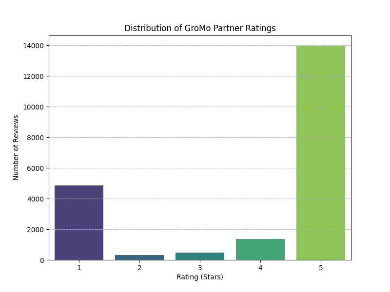

### 2. Review Volume Over Time

This line plot illustrates the number of reviews submitted each month. It helps identify periods of increased or decreased user feedback activity.

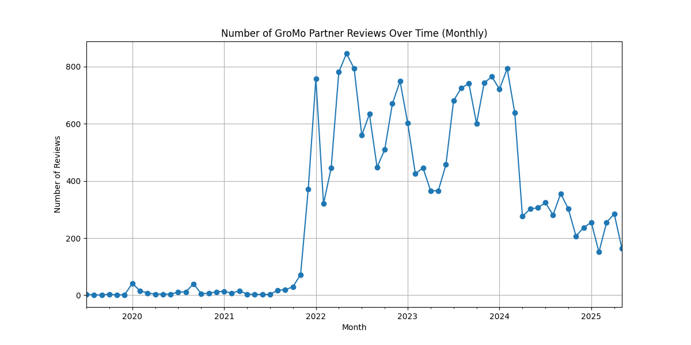

### 3. Average Rating Over Time

This line plot tracks the average star rating of reviews on a monthly basis. It helps to understand if the overall user satisfaction is improving, declining, or remaining stable over time, compared to the overall average rating.

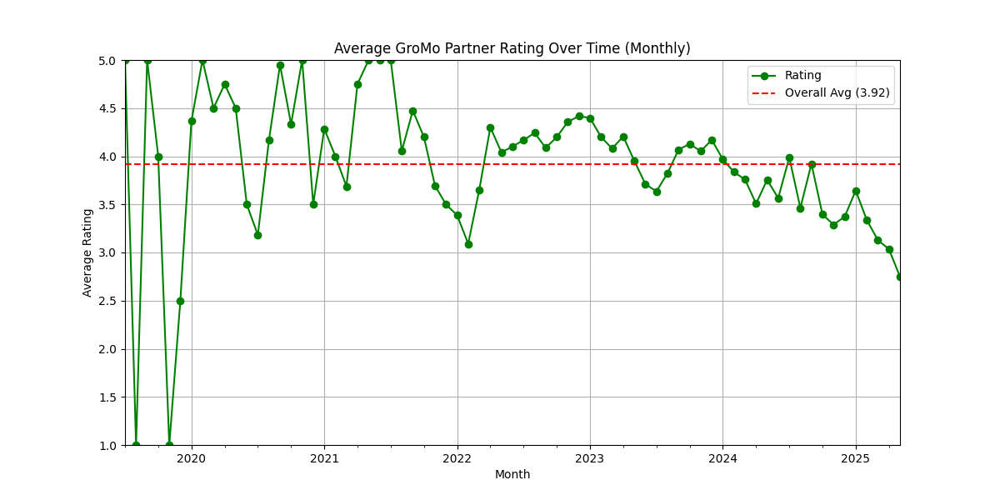

### 4. Text Analysis (Negative Reviews)

Analysis of 1-star and 2-star reviews helps to pinpoint specific issues and common complaints.

- **Top N-grams:** These plots show the most frequently occurring single words (unigrams), two-word phrases (bigrams), and three-word phrases (trigrams) in negative reviews after preprocessing. They highlight recurring themes in critical feedback.

  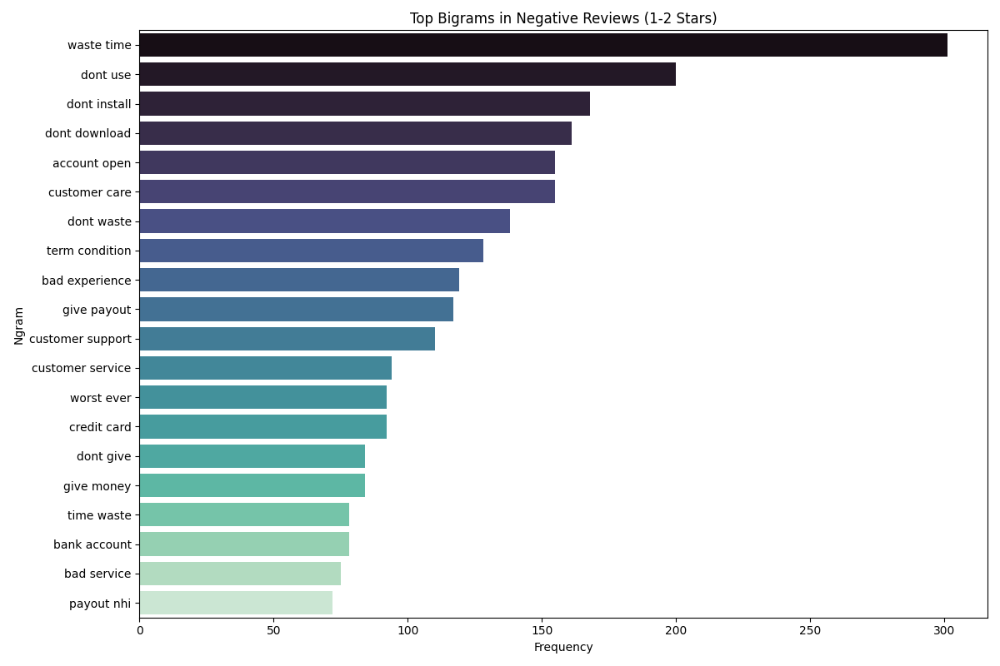
  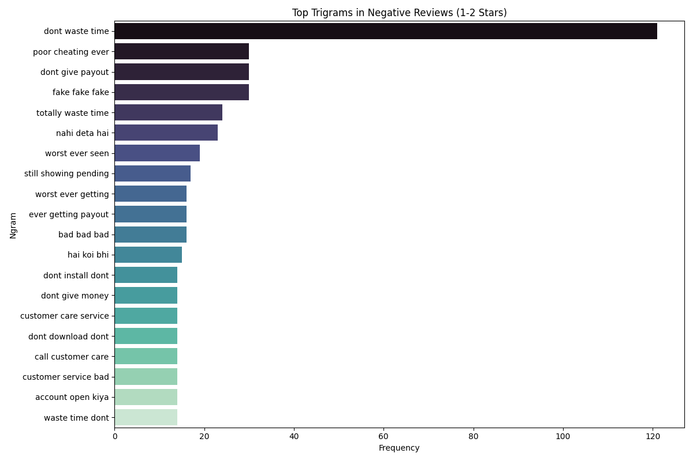

- **Word Cloud:** A visual representation where the size of each word indicates its frequency in negative reviews. It provides a quick overview of the most prominent terms used by dissatisfied users.

  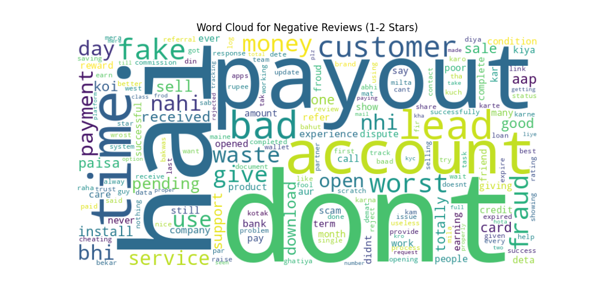

### 5. Sentiment Analysis (VADER)

VADER (Valence Aware Dictionary and sEntiment Reasoner) is used to analyze the sentiment of review messages.

- **Sentiment Distribution:** This plot shows the overall distribution of reviews categorized as Positive, Neutral, or Negative based on their VADER compound sentiment score.

  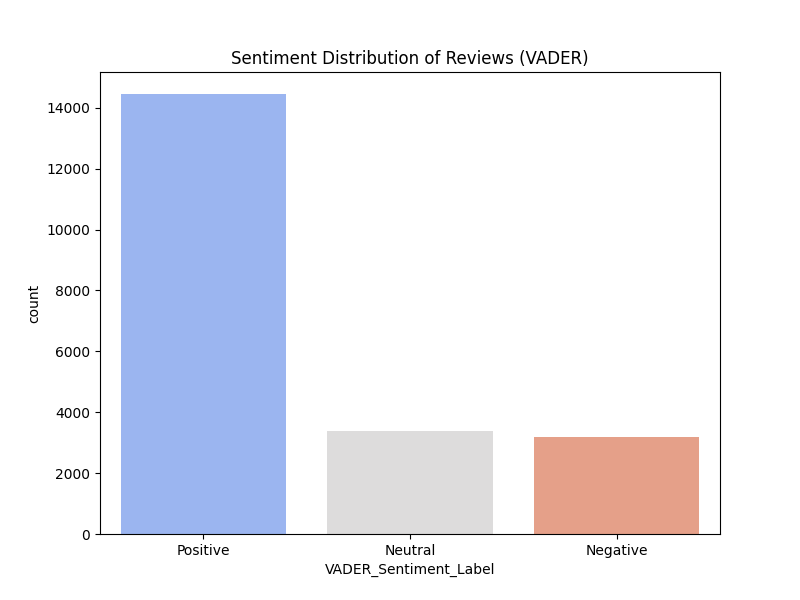

- **VADER Sentiment vs. Star Rating:** This box plot shows the range and distribution of VADER compound sentiment scores for each star rating. It is expected that lower star ratings correlate with more negative sentiment scores.

  

### 6. Developer Engagement

This analysis examines the presence of developer replies to user reviews.

- **Developer Reply Rate:** This bar chart shows the overall percentage of reviews that have received a reply from the developer.

  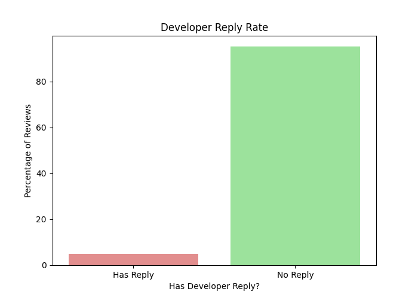

- **Developer Reply Rate by Star Rating:** This bar chart breaks down the developer reply rate by star rating, indicating whether the developer is more or less likely to respond to reviews of a certain rating.

  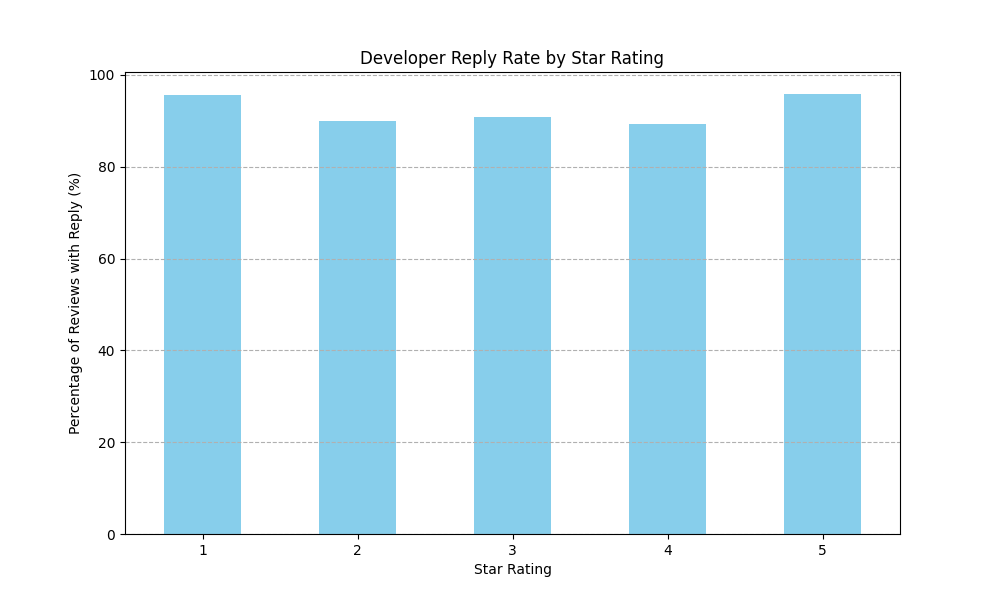

### 7. Pain Point Analysis Over Time

This analysis identifies mentions of specific keywords related to known pain points within the reviews and tracks their frequency over time. The plots in the `pain_point_plots/` and `review_problem_graphs/` directories show the monthly percentage of reviews mentioning each category of pain point. This helps to understand which issues are becoming more or less prevalent.

- **Identified Pain Points:**

  - Account/KYC Issues
  - App Performance
  - Commission/Earnings
  - Customer Support
  - Lead Issues
  - Payment Issues
  - Product Info/Training
  - Account Blocking/Deactivation
  - Accusations of Fraud/Scam
  - Data Privacy Concerns
  - Hidden High Charges and Fees
  - Lead Tracking and Status Issues
  - Misleading T&Cs/Promises
  - Payout Issues (Not Received/Delayed)
  - Poor Customer Support

  Examples of Pain Point Trend Plots:

  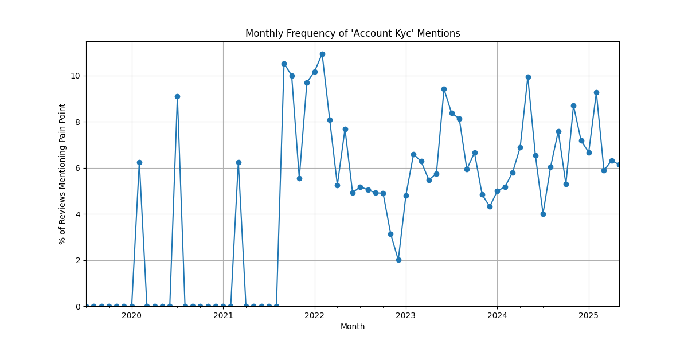
  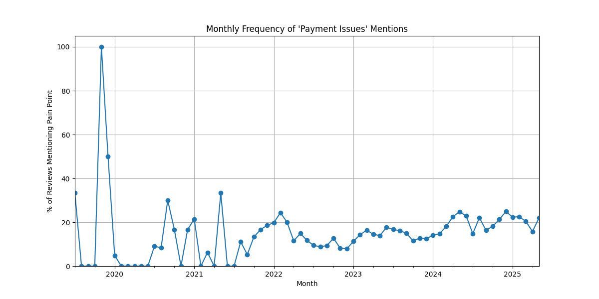
  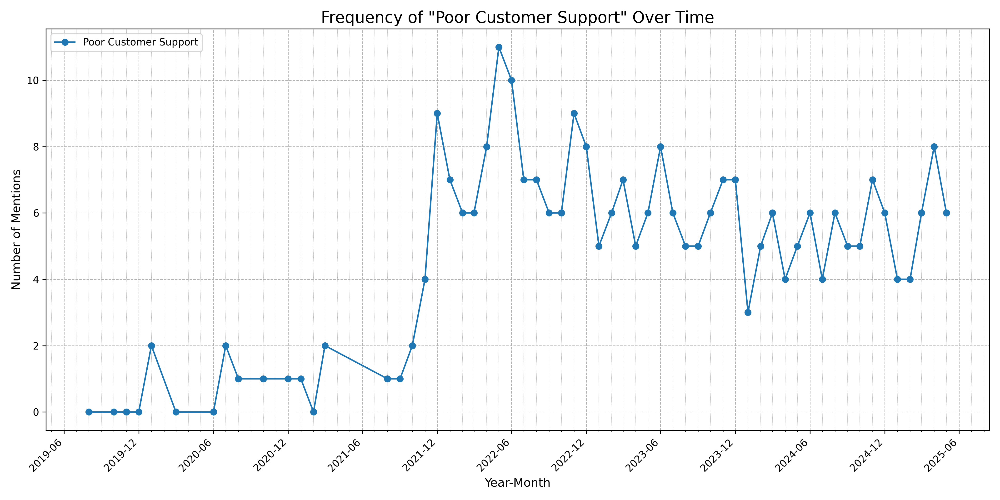
  _(Note: More trend plots are available in the `pain_point_plots/` and `review_problem_graphs/` directories)_

## Conclusions and Recommendations

Based on the analysis of the GroMo Play Store reviews, the following conclusions can be drawn:

- **Rating Distribution:** The app receives a significant number of low ratings (1 and 2 stars), which indicates substantial user dissatisfaction among a segment of the user base. The average rating provides a single metric, but the distribution highlights the polarization of user experience.
- **Review Trends:** Analyzing review volume and average rating over time can reveal if recent changes or events have impacted user feedback. An increasing volume of negative reviews or a declining average rating would signal worsening issues.
- **Key Pain Points:** The n-gram analysis and pain point trend analysis are crucial for identifying the specific reasons behind negative reviews. Common terms and increasing trends in categories like "payment issues," "customer support," and "app performance" suggest these are critical areas requiring immediate attention.
- **Sentiment vs. Rating:** The correlation between VADER sentiment scores and star ratings validates the use of sentiment analysis as a proxy for user satisfaction and helps confirm that the text content aligns with the numerical rating.
- **Developer Engagement:** The developer reply rate, especially for low-rated reviews, is an important indicator of responsiveness to user issues. A low reply rate for 1-star reviews might exacerbate user frustration.

**Recommendations:**

1.  **Prioritize Addressing Key Pain Points:** Focus development and support efforts on the pain points identified as most frequent or showing increasing trends (e.g., payment issues, customer support responsiveness, app stability).
2.  **Improve Developer Reply Strategy:** Increase the rate and quality of developer replies to low-rated reviews. Acknowledging issues and providing clear next steps can improve user perception and potentially lead to updated reviews.
3.  **Monitor Trends Closely:** Continuously monitor review volume, average rating, and pain point trends over time to quickly identify emerging issues or the impact of implemented solutions.
4.  **Deep Dive into Negative Feedback:** Use the filtered 1-star reviews (`gromo_play_store_rating_1.csv`) and the n-gram/word cloud analysis to perform deeper qualitative analysis into the specific nuances of the most critical complaints.

## How to Run the Analysis

1.  Ensure you have Python and the necessary libraries installed (pandas, matplotlib, seaborn, nltk, wordcloud, scikit-learn). You can install them using pip: `pip install pandas matplotlib seaborn nltk wordcloud scikit-learn`
2.  Make sure the input CSV file (`gromo_play_store_reviews_detailed.csv`) is in the correct location or update the `CSV_FILE_PATH` variable in [`data_analysis.py`](data_analysis.py).
3.  Run the analysis script: `python data_analysis.py`
4.  The script will generate PNG image files for the plots in the current directory and the `pain_point_plots` and `review_problem_graphs` subdirectories, and print some findings to the console.
